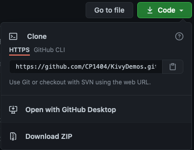
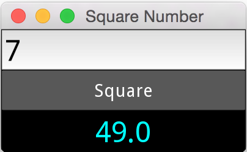
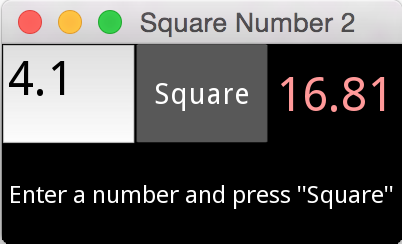
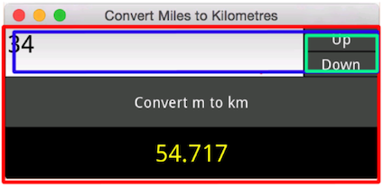
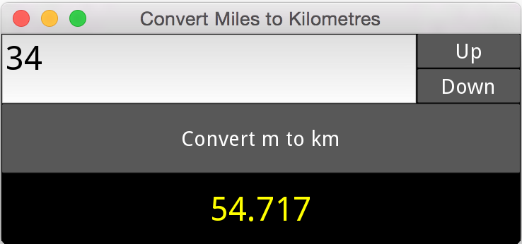
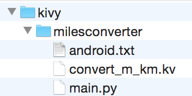

# Practical 07 - Kivy

Note: This is a fairly long practical, so allocate more than the usual time for it.  
There are a lot of demos to learn and copy from in <https://github.com/CP1404/KivyDemos>.

If you're using your own computer, and you haven't already done so,
please follow the setup instructions for installing Kivy at:
<https://github.com/CP1404/Starter/wiki/Software-Setup>

If you haven't already, **please save yourself time and make life easier** 
by adding kv language syntax highlighting and auto-completion
(since PyCharm does not know about kv language by default):

-   Download: <https://github.com/Zen-CODE/kivybits/blob/master/IDE/PyCharm_kv_completion.jar?raw=true>

-   In PyCharm's main menu, click **Import Settings** or **File >
    Import**, depending on your version

-   Select the .jar file you just downloaded and click OK in the dialog
    with file types.

-   Restart PyCharm.

***Seriously***, it's worth the 1-2 minutes that this will take.  
On JCU computers you will have to do it every time, so save the download file on your USB or network
drive for next time.

# Walkthrough Example

**Download** the GitHub repository for our Kivy Examples:
[https://github.com/CP1404/KivyDemos](https://github.com/CP1404/KivyDemos)

You could use Git to clone it, which makes a complete copy, including
the Git history, but since you don't have write permissions on this
repo you will not be able to push changes back to it. The easiest thing
is just to use the GitHub website to **Download ZIP**.



1.  The work that you do for this practical should be saved, committed and pushed to
    your Practicals repository in the `prac_07` folder. The simplest
    thing is to just **copy everything from the demos zip you just
    downloaded into your `prac_07` folder**. Then only commit the work
    you do. You don't need to upload all the other examples to
    GitHub, but you can if you really really want.

2.  (Here's a very simple example)  
    Open and run the `hello_world.py` file.  
    You should see a plain black window with "HelloWorld" in the title.

3.  (Here's an advanced example)  
    Open and run the `popup_demo.py` file (which uses
    `popup_demo.kv`) and run that to see how it works. You don't
    need to understand it all just yet, but try to get an overview of
    the structure, and look for the parts you do recognise.

## Modify Existing GUI Program

Open the `box_layout_demo.py` and `box_layout.kv` files and run
the Python program. You should see three vertical buttons.

Let's extend this program to make an app that lets the user enter and
clear their name, and greets them when we push a button. It will end up
looking like this:  


1.  Add a **label** below the third button with the **text** "Enter your
    name":

```
Button:
    text: 'three'
Label:
    text: 'Enter your name'
```

2.  Set the new label's text colour to yellow, by adding the following
    property details "inside" the label:

        color: (1, 1, 0, 1)

3.  Change the first button so it says "Clear" and the third button so
    it says "Greet".

4.  Now to add a button handler, you need to edit both the py and kv
    files. Look at the 'id_demo' files for a good example of this...  
    Add a callback for the press event in the kv file, like:

        Button:
            text: 'Greet'
            on_press: app.handle_greet()

    This references a method in your main app class called
    `handle_greet()`.

5.  Add the `handle_greet()` function in your .py file and put a `print('greet')`
    statement in that function.  
    Test it. If this works, and you see 'greet' in the console (not the
    Kivy window), then you know the connection between the button and
    this function works, so you can keep going...

6.  The next step is to change the text of the label.  
    Add an id to the label, like:

        id: output_label

7.  Now in your handle_greet function, change this label's text, like:

    ```python
    print("test")
    self.root.ids.output_label.text = "Hello "
    ```

8.  Change button "two" to a text input field, like:

        TextInput:
            id: input_name
            text: ''

9.  Since this field has an id, we can now use the information in this text
    entry field in our button handler function, like:

        self.root.ids.output_label.text = "Hello " + self.root.ids.input_name.text

    You should now be able to type in the text field and click the button
    to greet by name.  
    Test it and make any changes as needed...   
    and make sure you understand how this works!

10. Lastly, **add a new event handler** for the clear button so that it
    resets _both_ the text field and the output label to blank.

# Intermediate Exercises



Open the `squaring.py/kv` files from the demos.

Run the code to see a simple app with a text entry field, a button and a
label that squares a number.  
Spend a while reading the code so you know how it works. Pay special
attention to the functionality - how it handles the button being
pressed:

# Modifications


-   Change the output Label text colour to pink (`color` is an RGBA tuple).

-   Change the orientation so the widgets display left-to-right instead
    of top-to-bottom.

-   Add a label at the bottom with the text: `Enter a number and press
    "Square"`.

    To do this you will need to use **nested layouts**.  
    There are two 'sections', made with `BoxLayout`, arranged vertically:

    -   In the top section (BoxLayout), there are three widgets, 
        arranged horizontally.
    
    -   In the bottom section, there is just one label.

    A good way to think about organising BoxLayouts is to draw boxes to
    represent them. You can have multiple widgets and/or BoxLayouts arranged
    within a BoxLayout.

-   
    So, in the example image here (Convert Miles to Kilometres), you should
    notice that the Up and Down buttons are vertically arranged within a
    BoxLayout (the green box).

-   This green layout is horizontally arranged next to a TextInput, so
    these must be inside another BoxLayout (the blue box).

-   This blue layout (the top third) is vertically arranged along with
    the "Convert" button and the label below it inside yet another
    BoxLayout (the red box).

-   The red BoxLayout will be the top level widget.  
    Nice...

**Refactoring Example:**

Have a look at the following commit "diff" for the squaring program:
<https://github.com/CP1404/Practicals/commit/2f9b38dcfc393e2f50f9b30f6da36f9aabf4ee1f>

You can see that we changed the code so that the button handler function now
takes in the value of the text field as a parameter instead of getting
it. This makes the logic less _"tightly coupled"_ to the view.  
It still puts
the calculated result back in the view directly, so it's only one step
towards better separation, but it does show you how Git and GitHub can
record and show your progress as you improve your code by refactoring.

# Do-from-scratch Exercises

## Miles to Kilometres Converter

Create a Kivy program, `convert_miles_km.py`, and use the kv language, `convert_miles_km.kv`, 
to recreate the following layout.  
(The dark grey with white boxes are Buttons, the black with yellow text is a
Label and the black on white one is a TextInput.)



When you have created the layout, write the functionality for the whole
program. As always, do this in small steps.

-   Use a `StringProperty` for the text on the output (km) label.  
    Then in the app you can set this property variable without having to 
    manually update the text of the label. It will automatically update.  
    See the `mvc_demo.py` and kv file in the demos for an example of this.

-   You should be able to type a number in the text entry field.

-   Pressing the "Convert" button should calculate the conversion from
    miles to kilometres and display this in the bottom label. (Oops, "m"
    in the screenshot is not a good abbreviation for "miles".)

-   Pressing the Up or Down buttons should make this (miles) number go up/down by 1

    -   Note: You can handle both of these with the same function by
        passing a value, e.g.  
        `on_press: handle_increment(-1)`
        Or, you may like to pass the text of the input field when you call this, like:
        `on_press: handle_increment(whatever_your_input_id_is.text, -1)`


### Stage 2

-   Handle invalid inputs. If the text entered is not a valid number,
    just set the output result to 0.0.  
    It should not crash or produce errors in the console.

-   Pressing Up/Down when the box is empty or invalid should assume the
    value is 0 and change it to 1/-1.

-   Remove the convert button (comment it out) and make the result appear immediately
    when either text is entered or the up/down buttons are pressed (you
    can handle this with Kivy's `on_text` event)
    
-   Did you use a `CONSTANT` in your conversion calculation?  
    Do this now if you haven't already. 

**Note:** The solution to this is provided (`convert_miles_km.py/kv`).  
Don't just copy it, but do use it if you get stuck, and/or to compare your solution to ours.

## Dynamic Kivy Widgets

All of these programs so far have had the widgets "hard-coded" in the
.kv file, but what if we want to create dynamic widgets based on a
variable or the contents of a file or something?

Open `dynamic_widgets.py/kv` to see how this can be done.

The keys to this are:

-   Give an `id` to the layout widget that you want to add items to
    (in the .kv file)

    -   Note that this cannot be the root widget!

-   Create the widgets (e.g. buttons) in Python code, e.g. 
        
        temp_button = Button(text=name)

-   Add these new widgets using the `add_widget` method, e.g.

        self.root.ids.entries_box.add_widget(temp_button)

-   Bind a function callback when you make the widget object to add
    event handler code, e.g.

        temp_button.bind(on_release=self.press_entry)

So now it's your turn...

**Create a very simple app, `dynamic_labels.py` that has a list of names (strings) and
displays each one as a separate *Label*.**

**Note:** Start a new blank program for this; do not copy the
dynamic_widgets example as it is too different. Your app won't have
any buttons or interactivity. Use the example only as a reference.

# Practice & Extension Work

## Practice
1.  Modify your Greeter Program so the GUI layout looks like:

    

    Hint: BoxLayouts inside a BoxLayout, and a `size_hint_x`...

2.  Create a simple GUI similar to your greeting app that lets a user
    type in their score out of 100, click a button and the app shows
    "Pass" or "Fail" (based on the value) in a label.

    - Then extend this to show the JCU grade (e.g. 65-75 is a credit).

3.  Make a GUI for the temperature converter program you did in the
    first practical.  
    It will be very similar to the miles to kilometres program, but
    instead of just copying that one and modifying it, try doing the new
    one from scratch and only looking at the miles converter to help you
    if you need it.

4.  Make a dynamically generated GUI with a button for each person found
    in a file. Load the file at the start, that contains lines like
    "Name,age" (e.g. "Bill Gates,72"). Display one button for each
    person with their name on the button. When you push the button it
    should show their age in a label at the bottom.

## Extension

1.  Do you have an **Android** device? If so, run one or more of your
    Kivy apps on it using **Kivy Launcher**, as described at:
    <http://kivy.org/docs/guide/packaging-android.html#packaging-your-application-for-the-kivy-launcher>
    
    
    
    If your Android device does not have an SD Card installed, then place
    your Kivy apps within internal storage, in a folder called kivy, with a
    subfolder for your project, and make sure you have a `main.py` and
    `android.txt` (as explained at the link above) in that folder, like
    this:
    
    
    
    Then you'll experience much joy with your (first!) Android app!
    
    You may also want to look at [python-for-android](https://github.com/kivy/python-for-android)

2.  **Customise your views**
    Open, run and inspect Jason's QuickSum Kivy app from (two files, `quick_sum.py/kv`).
    As explained in the lectures, notice the way it uses:
    -   class rules like `<Button>`
    -   `canvas.before` and `canvas.after` to change the background colour or other aspects of a widget
    Use these techniques to change your miles->kilometres converter to use black text on white background widgets - or something else that you'd
    like visually.  
    Play around as much as you like with this, but don't worry about all 
    the details of getting exactly the style you want.

3.  **Implement our "GuessingGame" app**
    We started working on a simple guessing game Kivy app here: <https://github.com/CP1404/GuessingGame>
    -   Form a team of two students for some **pair programming**
    -   Have a look at the repo, and try your hand at making the app work
    -   Then make a Pull Request back to us.

# Deliverables
This section summarises the expectations for marking in this practical.

- `box_layout_demo.py/kv` with modifications (greet, clear)
- `squaring.py/kv` with modifications
- `convert_miles_km.py/kv`
- `dynamic_labels.py` with Labels (not Buttons)
