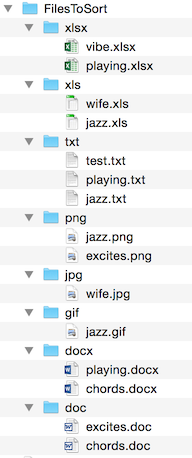
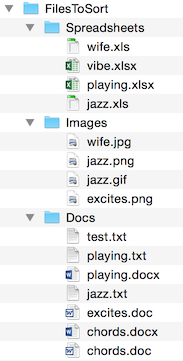

# Practical 09 - OS

Today we will explore Python as an automation tool to help us automate
repetitive tasks with files and the **os** module.

# Walkthrough Example

Download all of the files from this prac folder.

-   Extract the **Lyrics.zip** file so it's in a subdirectory called 
    Lyrics inside this prac folder.

-   Open the directory Lyrics/Christmas so you can see the files listed
    in your file browser or PyCharm  
    (but note that PyCharm doesn't always refresh as often as you might
    like).

-   Open the **os_demos.py** file, read the code and comments to see
    what it's demoing, then run it.  
    Notice that it imports the **os** and **shutil** modules for working
    with the operating system and files.

## Modifications:

(Follow the TODO comments in the code.)

1.  Run the program again, and you should get a crash due to trying to
    create an existing directory.  
    Use exception handling to avoid this crash. 
    Remember that you can read the crash message to see what exception you need to handle.

2.  There are two commented-out options. Try each, one at a time:  
    **Note:** renaming or moving files changes their names (amazing!),
    so to re-run your code with the files in their original state, you
    can just re-copy them from the Lyrics.zip file provided.

    a.  **rename** files (in same directory) using `os.rename()`

    b.  **move** files to a subdirectory with the new name using
        `shutil.move()`

3.  Restore your original files (extract the zip file again).  
    The last part of this file demonstrates the `os.walk()` function that "walks"
    through all subdirectories returning useful information about the
    contents...  
    Comment out the call to `main()` and uncomment `demo_walk()`.  
    Run the code to see how walk works.

4.  Add a loop that renames all of the files in `filenames`.  
    This should rename every file in every subdirectory... but 
    (depending on how you did this...) you will likely find that you get an error like
    
        FileNotFoundError: [Errno 2] No such file or directory: 'MySaviourLives.txt' -> 'MySaviourLives.txt'
    
    This is because `os.walk()` does NOT actually change into the directories.
    So, we can either do that manually or in our rename, we can use the path.  
    
5.  To get a file reference that `os.rename()` can work correctly with, add the path like:
    `os.path.join(directory_name, filename)`  
    First print this, so you can see what it looks like, then change the code so you
    actually rename the file - making sure to add the path in both the `src` and `dst` parameters for `os.rename()`.    

# Intermediate Exercises

_(Please read this whole section before starting work on it!)_  
**Note:** Set yourself a 30-minute timer and if you get stuck on this, 
just save your work and come back to it later.  
The next (do-from-scratch) exercises are another great example of os automation
based on a real-world need, so get moving on them.

The files we're working with today are from a **real-world example**.
Lindsay uses words projection software at church that takes these files.
The lyrics files had all kinds of different naming formats and he
wanted them to follow the same format.  
So, Lindsay wrote a Python script to rename the files to be consistent.
This is another example of using programming to automate tasks in your
everyday life! Nice :)  
Now it's your turn to write this script...

This program will be very similar to the walkthrough we just did, but
the focus is now on the renaming part:  
the `get_fixed_filename()` function.

-   *Commit your work.*  
    Copy the code from os_demos.py to a new file called
    **cleanup_files.py**.  
    Clean up (remove) any commented-out code or TODOs/comments from the
    demo that you don't need in this program.  
    *Commit your work.*

-   Notice that the existing files have been named inconsistently, e.g.
    some are PascalCase like "SilentNight.txt" and some have spaces like
    "Away In A Manger.txt" or are not in Title Case like  
    "O little town of bethlehem.TXT"  
    Write code to make them consistently use the format like
    "Away_In_A_Manger.txt", "Silent_Night.txt" and
    "O_Little_Town_Of_Bethlehem.txt" respectively:

  |**Existing Filename (inconsistent format)**  | **Desired Filename (consistent)**
  |---------------------------------------------| ------------------------------------
  |Away In A Manger.txt                         | Away_In_A_Manger.txt
  |SilentNight.txt                              | Silent_Night.txt
  |O little town of bethlehem.TXT               | O_Little_Town_Of_Bethlehem.txt
  |ItIsWell (oh my soul).txt                    | It_Is_Well_(Oh_My_Soul).txt

### Important

Do NOT try and solve all of these cases at once. Rather, work up to
them, building the **`get_fixed_filename()`** function that returns a
fixed filename. Test just printing the names before renaming the files.
When it works for one case, make it handle another one and so on...
iterative development!

### Hints

-   You will **not** find simple string methods like **`replace()`** that
    can solve all of this problem for you.

-   A good approach would be to **step through each character with its
    index** with **`enumerate()`** and consider how it relates to the
    character before or after it, since the context is what matters
    here.  
    E.g. if the current character **`islower()`** and the next character
    **`isupper()`** such as with the "tN" in "SilentNight"), then you
    know you need to put '_' between them.

-   You can start with an empty string `""` and build it using string
    concatenation step-by-step as you determine what the next character
    should be. E.g. for the above case, you can add the 't', then the
    '_' to your new filename string, then move on to the next
    iteration in the for loop where you will add the 'N'.

# Do-from-scratch Exercises

-   Extract the **FilesToSort.zip** file, which contains files with
    various names and extensions.

-   Write code to sort these files into subdirectories for each
    extension.

## Version 1

Use **`os.mkdir()`** to create a directory with for each new extension
that your program finds and use **`shutil.move()`** to move files into
these new directories.  
E.g. move all files ending in ".txt" to a directory you create called
"txt", and all ".doc" files to a "doc" directory.

Do not try and create directories you've already made.

**Tip:** You might like to add the extensions to a list or a **set** as
you process the files.

|**Before:**                                   | **After:**
| ---------------------------------------------| ---------------------------------------------
| |    

## Version 2

Let the user categorise different extensions as the program encounters
these, then move them all into those subdirectories. E.g.

-   one user might want a category "docs" containing all .doc, .docx,
    .rtf, .txt... and an "images" folder containing .jpg, .gif, .png.

-   another user might want a category "office" containing .doc, .docx,
    .xls, but put the .txt files in a "text" category directory.

**Tip:** Add the extensions to a **dictionary** and make a list of the
categories as you process the files.

**Note:** there are two parts to this - **categorising the extensions**
and **moving the files**. You should approach them as separate steps.

For one example run with these files (user input in **bold**):

<pre>
What category would you like to sort doc files into? <strong>Docs</strong>
What category would you like to sort docx files into? <strong>Docs</strong>
What category would you like to sort png files into? <strong>Images</strong>
What category would you like to sort gif files into? <strong>Images</strong>
What category would you like to sort txt files into? <strong>Docs</strong>
What category would you like to sort xls files into? <strong>Spreadsheets</strong>
What category would you like to sort xlsx files into? <strong>Spreadsheets</strong>
What category would you like to sort jpg files into? <strong>Images</strong>
</pre>

|**Before:**                                   | **After:**
| ---------------------------------------------| ---------------------------------------------
| |    

# Practice & Extension Work

## Check files for missing data

The song lyric text files should all have copyright information in them
on a line that starts with **.i** like:

    .i (c) 2011 Thankyou Music (Admin. by Crossroad Distributors Pty. Ltd.)

Write a program that reports the names and directories of all of the files
that are missing this line.

**Version 2**

Automatically look up the copyright information from the Internet based
on the song title and author, then add the data to the file...  
Good luck with that ;)
